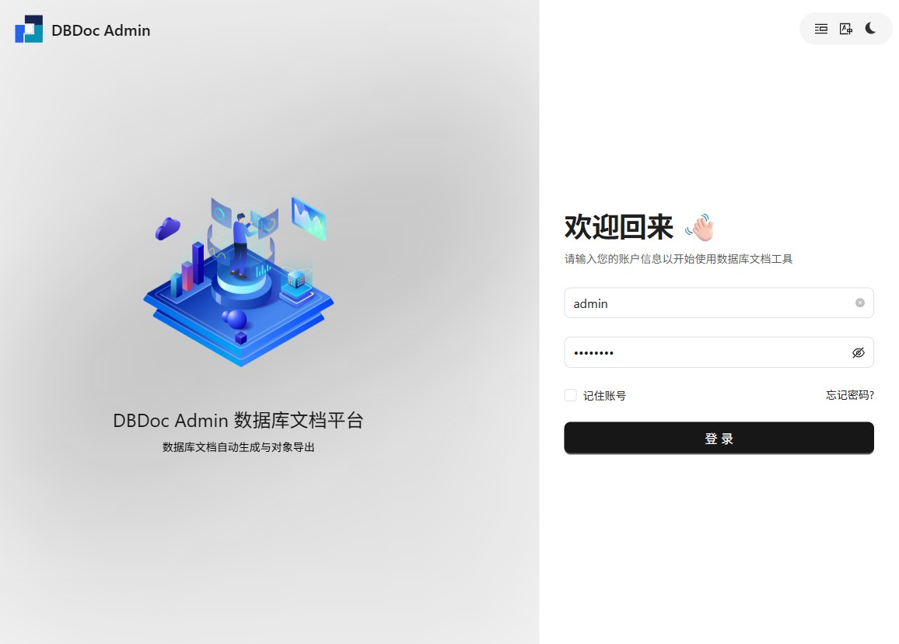
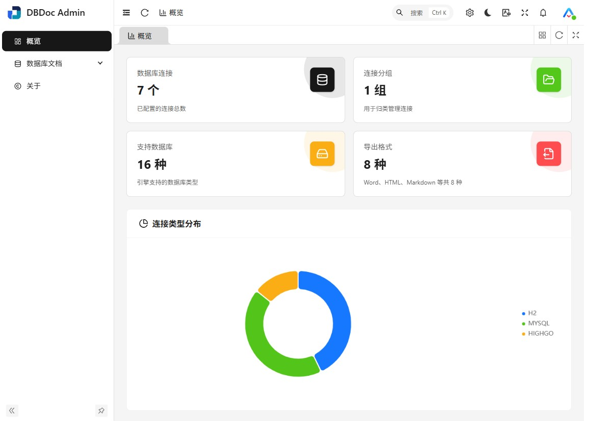
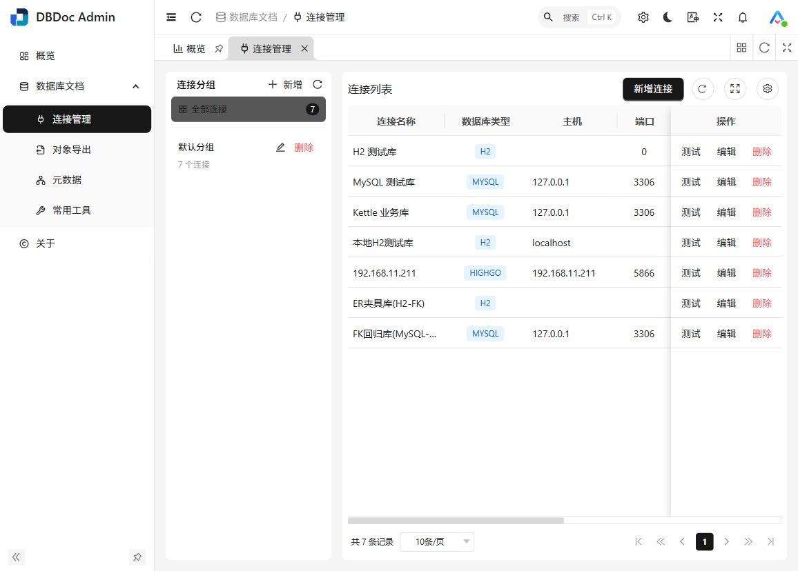
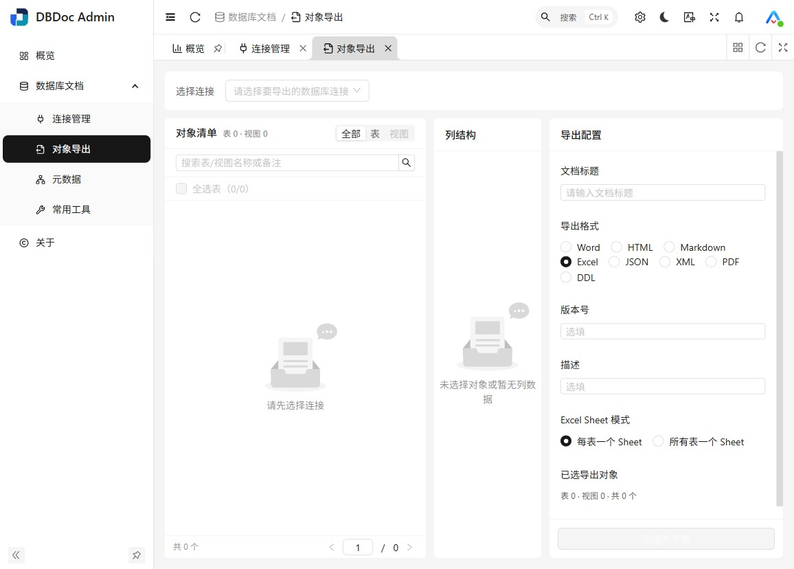

# DBDoc

**⚡ 数据库表结构文档生成平台 · 连接业务库，一键生成表结构文档**

_基于 [smallbun/screw](https://github.com/smallbun/screw) 增强引擎的 Web 平台化实现_

---

## 概览


**数据库支持:**


---

## 预览

| 登录 | 概览 |
|:---:|:---:|
|  |  |
| **连接管理** | **对象导出** |
|  |  |

---

## 🚩 项目介绍

DBDoc 把「生成数据库文档」从命令行工具升级为 **Web 平台**：业务人员也能自助完成数据库连接配置 → 对象选择 → 文档导出的全流程。

核心引擎在 [smallbun/screw](https://github.com/smallbun/screw) 基础上深度增强——Excel 单/多 Sheet 双模式、Word 模板九列对齐、视图（VIEW）文档支持、达梦 / 瀚高等国产数据库方言，并对国产化环境实测验证。

> 🚀 一站式完成：连接管理 · 对象导出 · 元数据浏览 · 代码生成 · 库表对比

---

## 📖 主要功能

### 文档内容包含什么？

- `表` 序号 | 列名 | 主键 | 自增 | 数据类型 | 长度 | 允许NULL | 默认值 | 备注说明
- `视图` 视图 SQL 脚本与字段说明
- `索引/主键` 表索引与主外键关系

### 支持导出哪些文档格式？

| 📄 Word | 📊 Excel | 📝 Markdown | 🌐 HTML |
|:---:|:---:|:---:|:---:|
| 单 Sheet / 多 Sheet | 九列对齐模板 | Gitee/GitHub 友好 | 单文件离线可查 |

### 平台功能模块

| 模块 | 能力 |
|---|---|
| **连接管理** | 多库连接配置、分组管理、连接测试、凭据 AES 加密存储 |
| **对象导出** | 表/视图勾选导出，四种格式，同步生成文档任务记录 |
| **元数据** | 库-表-字段三级浏览，快速摸清业务库结构 |
| **常用工具** | 实体/SQL 代码生成、双库结构对比（差异+同步）、DDL 预览、表关系图 |
| **系统底座** | 登录认证（BCrypt + Token）、个人中心、RSA/AES 传输加密、前后端单 jar 部署 |

---

## 💎 数据库支持

- ✅ MySQL（实测验证）
- ✅ Oracle
- ✅ PostgreSQL
- ✅ 达梦 DM（国产化 · 实测验证）
- ✅ 瀚高 HighGo（国产化 · 实测验证）
- ✅ SQL Server / SQLite（引擎级支持，随核心库能力）

---

## 架构总览

```
┌────────────────────┐      /prod-api/*       ┌────────────────────┐
│  jimuqu-admin-ui   │ ─────────────────────► │     screw-web      │
│  Vue3 · Vite 前端  │  RSA/AES 传输加密      │  Spring Boot 3 后端 │
└────────────────────┘ ◄───────────────────── └─────────┬──────────┘
                                                        │ 内嵌调用
                                              ┌─────────▼──────────┐
                                              │    screw-master    │
                                              │  screw-core 文档   │
                                              │  生成引擎（增强版） │
                                              └─────────┬──────────┘
                                                        │ JDBC
                                              ┌─────────▼──────────┐
                                              │  业务数据库          │
                                              │  MySQL/Oracle/达梦… │
                                              └────────────────────┘
```

---

## 快速开始

### 1. 构建核心库（首次需要）

```bash
mvn -f screw-master/screw-master/pom.xml clean install -DskipTests
```

### 2. 启动后端

```bash
cd screw-web
mvn spring-boot:run
# 或打包运行： mvn package && java -jar target/screw-web-*.jar
```

- 服务地址：<http://localhost:8760>
- 数据库：内置 H2 文件库（`data/screwweb.mv.db`，自动创建，重启不丢数据）
- H2 控制台：<http://localhost:8760/h2-console>（用户 `sa`，密码空）

### 3. 前端开发模式（可选，生产可直接用内嵌前端）

```bash
cd jimuqu-admin-ui
pnpm install
pnpm dev
```

### 4. 生产构建（前端内嵌进后端 jar）

```bash
cd jimuqu-admin-ui && pnpm build     # 产物 dist/
cd ../screw-web && mvn package       # 打包时复制 dist 进 jar
java -jar target/screw-web-*.jar
```

### 默认账号

`admin / admin123`（首次登录后请立即在「个人中心 → 安全设置」修改密码）

---

## 目录结构

```
dbdoc/
├── screw-master/            # 文档生成核心库
│   ├── screw-master/        #   Maven 聚合父 POM（构建入口）
│   ├── screw-core/          #   生成引擎核心
│   ├── screw-extension/     #   扩展模块
│   ├── screw-maven-plugin/  #   Maven 插件
│   ├── codestyle/           #   代码风格配置
│   └── lib/                 #   本地依赖
├── screw-web/               # Spring Boot 后端
└── jimuqu-admin-ui/         # Vue3 前端
```

---

## 安全说明（部署必读）

- **传输加密**：前端生产构建默认开启 `VITE_GLOB_ENABLE_ENCRYPT=true`，对敏感接口（如修改密码）使用
  `RSA(encrypt-key 头) + AES/ECB` 加密请求体；后端 `EncryptRequestDecryptFilter` 自动解密。
- **演示密钥**：`jimuqu-admin-ui/.env.production` 与 `screw-web/application.yml` 中的 RSA/AES 密钥为
  **前后端配对的演示密钥**（前端本就内置私钥用于响应解密，不构成云凭据泄露），生产部署请务必：
  - 后端通过环境变量覆盖：`SCREW_AES_KEY`、`SCREW_RSA_PRIVATE_KEY`、`SCREW_RSA_PUBLIC_KEY`
  - 或重新生成密钥对并同步替换前后端两侧
- **数据目录**：`screw-web/data/`（H2 业务数据，含业务库连接信息）已在 `.gitignore` 中排除，请勿提交。
- **H2 控制台**：生产环境建议关闭（`spring.h2.console.enabled=false`）。

---

## 致谢 / 来源声明

- 后端文档生成核心基于 [smallbun/screw](https://github.com/smallbun/screw)（Apache License 2.0）增强，遵循其原许可证。
- 前端基于 [jimuqu-admin-ui](https://gitee.com/chengliang4810/jimuqu-admin-ui) 定制。